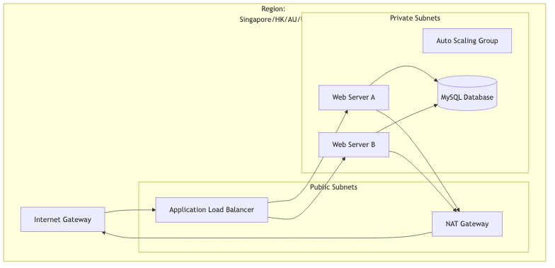
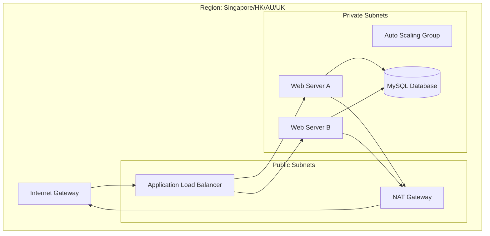
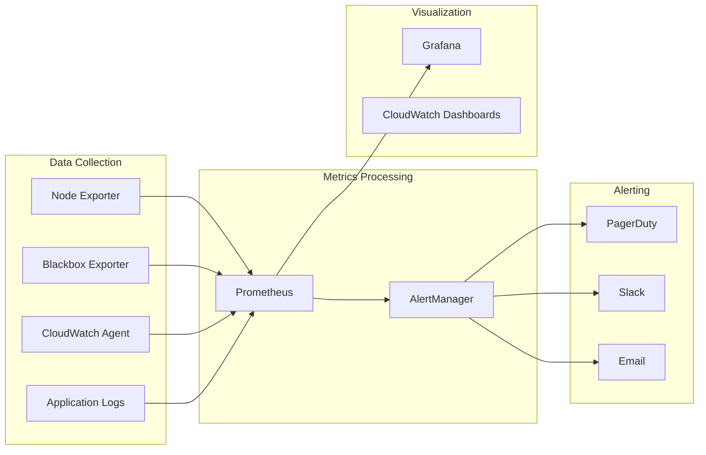

# Architecture Overview - Sleek Multi-Region Infrastructure

## System Architecture

The Sleek Multi-Region Infrastructure Monitoring Dashboard implements a comprehensive monitoring solution across four AWS regions, designed to meet financial services requirements with enterprise-grade reliability and performance.

## Regional Distribution Strategy

### Primary Regions
1. **Singapore (ap-southeast-1)** - APAC Hub & Primary Operations
2. **Hong Kong (ap-east-1)** - Greater China Market Access  
3. **Australia (ap-southeast-2)** - ANZ Financial Services
4. **United Kingdom (eu-west-2)** - European Operations Center

### Regional Architecture Pattern

Each region implements an identical infrastructure pattern for consistency and operational simplicity:

## Infrastructure Components

### Networking Layer
- **VPC**: Isolated network environment per region
- **Subnets**: Multi-AZ deployment with public/private separation
- **Internet Gateway**: Public internet access
- **NAT Gateway**: Secure outbound access for private resources
- **Security Groups**: Network-level access control

### Compute Layer
- **Application Load Balancer**: Layer 7 load balancing with health checks
- **Auto Scaling Group**: Dynamic capacity management (2-6 instances)
- **EC2 Instances**: Amazon Linux 2 with monitoring agents
- **Launch Templates**: Consistent instance configuration

### Data Layer
- **RDS MySQL**: Managed database service with Multi-AZ
- **Automated Backups**: 7-day retention with point-in-time recovery
- **Performance Insights**: Database performance monitoring
- **Enhanced Monitoring**: Detailed metrics collection

### Monitoring & Observability

## Monitoring Architecture

### Metrics Collection
- **Node Exporter**: System metrics (CPU, memory, disk, network)
- **Blackbox Exporter**: External health checks and synthetic monitoring
- **CloudWatch Agent**: Native AWS metrics integration
- **Application Metrics**: Custom business metrics via Prometheus client

### Alert Management
- **Prometheus**: Rule evaluation and alert generation
- **AlertManager**: Alert routing, grouping, and suppression
- **PagerDuty**: Incident management with escalation policies
- **Multi-channel**: Slack, email, and webhook integrations

## High Availability Design

### Redundancy Patterns
- **Multi-AZ Deployment**: Resources distributed across availability zones
- **Auto Scaling**: Automatic capacity adjustment based on demand
- **Load Balancing**: Traffic distribution with health checks
- **Database Replication**: Multi-AZ RDS with automatic failover

### Failure Scenarios
- **Instance Failure**: Auto Scaling replaces unhealthy instances
- **AZ Failure**: Traffic automatically routes to healthy AZ
- **Region Failure**: Manual failover to alternate region
- **Database Failure**: RDS Multi-AZ provides automatic recovery

## Security Architecture

### Network Security
- **VPC Isolation**: Complete network separation per region
- **Private Subnets**: Database and application servers isolated
- **Security Groups**: Principle of least privilege access
- **NACLs**: Additional subnet-level security controls

### Data Protection
- **Encryption at Rest**: RDS and EBS volume encryption
- **Encryption in Transit**: TLS for all communications
- **Secrets Management**: AWS Secrets Manager for credentials
- **Key Management**: AWS KMS for encryption key management

### Access Control
- **IAM Roles**: Service-to-service authentication
- **Instance Profiles**: EC2 access to AWS services
- **MFA Requirements**: Multi-factor authentication for admin access
- **Audit Logging**: CloudTrail for all API calls

## Scalability Considerations

### Horizontal Scaling
- **Auto Scaling Groups**: Automatic instance scaling (2-6 instances)
- **Load Balancer**: Distributes traffic across healthy instances
- **Database Scaling**: Read replicas for read-heavy workloads
- **Regional Expansion**: Consistent pattern for new regions

### Vertical Scaling
- **Instance Types**: t3.micro for demonstration, scalable to larger sizes
- **Database Classes**: db.t3.micro with ability to scale up
- **Storage**: GP2 with auto-scaling enabled
- **Memory/CPU**: Adjustable based on performance requirements

## Performance Targets

### SLA Requirements
- **Availability**: 99.99% uptime target
- **Response Time**: <500ms for financial services compliance
- **Error Rate**: <0.1% application errors
- **Recovery Time**: <30 minutes for incident resolution

### Monitoring Thresholds
- **CPU Utilization**: Alert at >80%
- **Memory Usage**: Alert at >85%
- **Disk Space**: Alert at <10% free
- **Response Time**: Alert at >2 seconds

## Cost Optimization

### Resource Optimization
- **Right-sizing**: Monitor and adjust instance sizes
- **Reserved Instances**: Purchase for predictable workloads
- **Spot Instances**: Use for non-critical batch processing
- **Auto Scaling**: Match capacity to demand

### Monitoring Costs
- **Resource Tagging**: Track costs by region, environment, team
- **Cost Alerts**: Notification for unusual spending patterns
- **Usage Reports**: Regular analysis of resource utilization
- **Optimization Recommendations**: Automated suggestions for cost savings

## Disaster Recovery

### Backup Strategy
- **Database Backups**: Automated daily backups with 7-day retention
- **Cross-region Replication**: Critical data replicated to backup region
- **Infrastructure as Code**: Complete environment recreation capability
- **Configuration Backup**: Monitoring configurations version controlled

### Recovery Procedures
- **RTO Target**: 30 minutes for critical services
- **RPO Target**: 1 hour maximum data loss
- **Failover Process**: Documented procedures for region failover
- **Testing Schedule**: Monthly disaster recovery drills

## Compliance & Governance

### Financial Services Requirements
- **Data Residency**: Data stored in appropriate geographic regions
- **Audit Trail**: Complete logging of all system activities
- **Access Controls**: Role-based access with approval workflows
- **Change Management**: Documented change processes

### Regulatory Compliance
- **SOC 2**: Security and availability controls
- **ISO 27001**: Information security management
- **PCI DSS**: Payment card industry standards (if applicable)
- **GDPR/CCPA**: Data privacy regulations

## Technology Stack

### Infrastructure
- **Cloud Provider**: Amazon Web Services (AWS)
- **Infrastructure as Code**: Terraform
- **Container Platform**: Docker (for monitoring stack)
- **Operating System**: Amazon Linux 2

### Monitoring & Observability
- **Metrics**: Prometheus + Grafana
- **Alerting**: AlertManager + PagerDuty
- **Logging**: CloudWatch Logs
- **Synthetic Monitoring**: Blackbox Exporter + Custom Python scripts

### Development & Operations
- **Version Control**: Git
- **CI/CD**: Shell scripts (extensible to Jenkins/GitHub Actions)
- **Configuration Management**: Terraform + Docker Compose
- **Documentation**: Markdown + Mermaid diagrams

## Future Enhancements

### Planned Improvements
- **Service Mesh**: Istio implementation for microservices
- **Container Orchestration**: EKS cluster deployment
- **Advanced Analytics**: Machine learning for anomaly detection
- **Global Load Balancing**: Route 53 health checks and failover

### Scalability Roadmap
- **Additional Regions**: Expansion to other Sleek markets
- **Microservices**: Decomposition of monolithic applications
- **Event-Driven Architecture**: Asynchronous processing capabilities
- **Real-time Analytics**: Streaming data processing

---

This architecture provides a solid foundation for enterprise-grade multi-region operations while maintaining cost efficiency and operational simplicity. The design emphasizes automation, monitoring, and incident response capabilities essential for financial services operations.